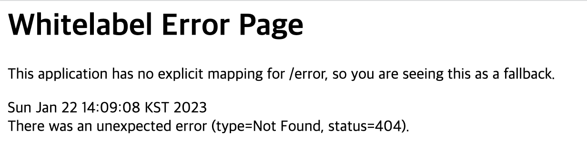
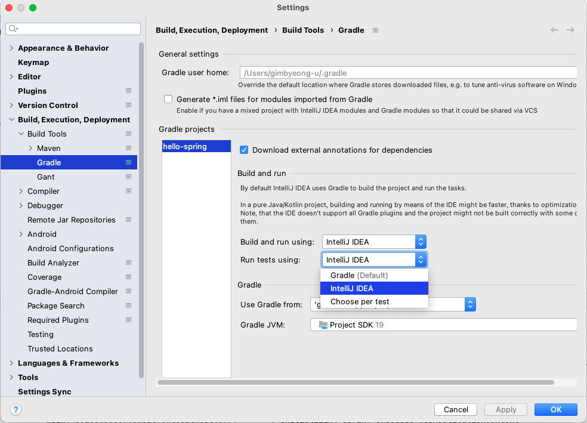
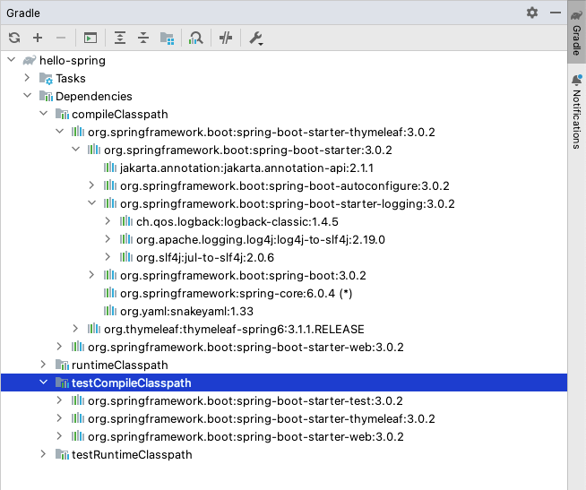
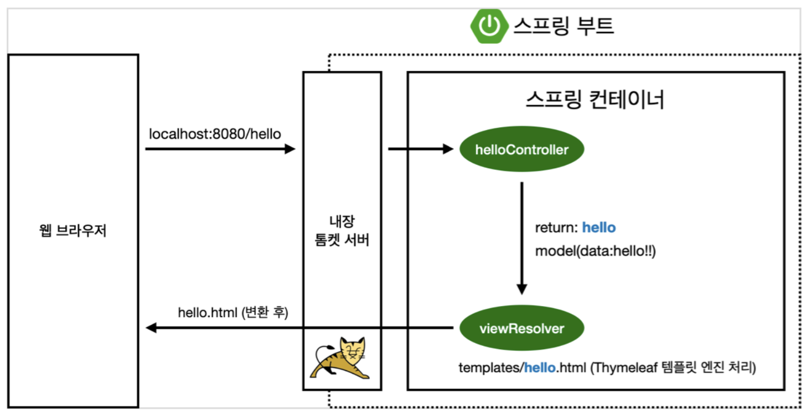

# Spring
## 간단한 웹 애플리케이션 개발
- 스프링 프로젝트 생성
- 스프링 부트로 웹 서버 실행
- 회원 도메인 개발
- 웹 MVC 개발
- DB 연동: JDBC, JPA, 스프링 데이터 JPA
- 테스트 케이스 작성
- 오래된 스프링 기술 X
- 마이너한 스프링 기술 X

---
## 로드맵
- 스프링 입문
- 스프링 핵심 원리
- 스프링 웹 MVC
- 스프링 DB 데이터 접근 기술
- 실전! 스프링 부트

---

## 프로젝트 환경설정
- 프로젝트 생성
- 라이브러리 살펴보기
- View 환결설정
- 빌드하고 실행하기

---

## 프로젝트 생성
**사전 준비물**
- java 11 설치
- IDE: IntelliJ 또는 Eclipse 설치
- *본좌는 IntelliJ 사용하겠다*


<br>

### 스프링 부트 스타터 사이트 이동 후 스프링 프로젝트 생성
https://start.spring.io/

<br>

### 프로젝트 선택
- Project Gradle Project
  - Spring Boot: 정식 버전 중 가장 최신(3.0.x)
  - Language: Java
  - Packaging: Jar
  - Java: 11
- Project Metadata
  - groupId: hello
  - artifactId: hello-spring
- Dependencies(어떤 라이브러리를 가져올 것인지): Spring Web, Thymeleaf

<br>

### Gradle 전체 설정
`build.gradle`
```groovy
plugins {
	id 'java'
	id 'org.springframework.boot' version '3.0.2'
	id 'io.spring.dependency-management' version '1.1.0'
}

group = 'hello'
version = '0.0.1-SNAPSHOT'
sourceCompatibility = '17'

repositories {
	mavenCentral()
}

dependencies {
	implementation 'org.springframework.boot:spring-boot-starter-thymeleaf'
	implementation 'org.springframework.boot:spring-boot-starter-web'
	testImplementation 'org.springframework.boot:spring-boot-starter-test'
}

tasks.named('test') {
	useJUnitPlatform()
}
```

<br>

### 실행
- src -> main -> java -> hello.hellospring -> HelloSpringApplication -> 실행  



<br>

### 실행속도 향상
- IntelliJ 사용 중이라면, IntelliJ Gradle 대신에 자바 직접 실행
- Settings -> Appearance -> Gradle 검색 -> Build and run using, Run tests using를 Gradle에서 IntelliJ IDEA로 바꿔줌

- Gradle을 통해 run 실행하는 것보다 IntelliJ를 통해 run을 실행하는 것이 속도가 더 빠를 때가 있기 때문에 설정해줌


<br>

---
## 라이브러리 살펴보기
> Gradle는 의존관계가 있는 라이브러리를 함께 다운로드 함



<br>

**스프링 부트 라이브러리**
- spring-boot-starter-web
  - spring-boot-starter-tomcat: 톰캣(웹서버)
  - spring-webmvc: 스프링 웹 MVC
- spring-boot-starter-thymeleaf: 타임리프 템플릿 엔진(View)
- spring-boot-starter(공통): 스프링 부트 + 스프링 코어 + 로깅
  - spring-boot
    - spring-core
  - spring-boot-starter-logging
    - logback, slf4j

**테스트 라이브러리**
- spring-boot-starter-test
  - junit: 테스트 프레임워크
  - mockito: 목 라이브러리
  - assertj: 테스트 코드를 좀 더 편하게 작성하게 도와주는 라이브러리
  - spring-test: 스프링 통합 테스트 지원

<br>

## View 환경설정
### Welcome page 만들기
- main -> java -> resources -> static에 index.html 만들어줌
```html
<!-- resources/static/index.html -->
  <!DOCTYPE HTML>
  <html>
  <head>
      <title>Hello</title>
      <meta http-equiv="Content-Type" content="text/html; charset=UTF-8" />
  </head>
  <body>
  Hello
  <a href="/hello">hello</a>
  </body>
  </html>
```
- 스프링 부트가 제공하는 Welcome Page 기능
  - static/index.html 을 올려두면 Welcome page 기능을 제공한다.
  - [스프링 부트가 제공하는 Welcome Page 기능](https:docsspringiospring-bootdocs231RELEASEreferencehtmlspring-boot-featureshtml#boot-features-spring-mvc-welcome-page)

<br>

- thymeleaf 템플릿 엔진
  - [thymeleaf 공식 사이트](https://www.thymeleaf.org/)
  - [스프링 공식 튜토리얼](https://spring.io/guides/gs/serving-web-content/)
  - [스프링부트 메뉴얼](https://docs.spring.io/spring-boot/docs/2.3.1.RELEASE/reference/html/spring-boot-features.html#boot-features-spring-mvc-template-engines)

<br>

---
## Controller 만들기
- main -> java -> hello.hellospring에서 controller 패키지 만들어줌
- 만든 controller 패키지 안에 HelloController 클래스 만들어줌
```
package hello.hellospring.controller;

import org.springframework.stereotype.Controller;
import org.springframework.ui.Model;
import org.springframework.web.bind.annotation.GetMapping;

@Controller
public class HelloController {
    @GetMapping("hello")
    public String hello(Model model){
        model.addAttribute("data", "hello!!");
        return "hello";
    }
}

```
<br>

- main -> java -> resources -> templates에서 hello.html 만들어줌
```html
<!DOCTYPE HTML>
<html xmlns:th="http://www.thymeleaf.org">
<head>
    <title>Hello</title>
    <meta http-equiv="Content-Type" content="text/html; charset=UTF-8" />
</head>
<body>
<p th:text="'안녕하세요. ' + ${data}" >안녕하세요. 손님</p>
</body>
</html>
```

<br>

- thymeleaf 템플릿엔진 동작 확인
- `http://localhost:8080/hello`

<br>

- 동작 환경 그림

- 컨트롤러에서 리턴 값으로 문자를 반환하면 뷰 리졸버( viewResolver )가 화면을 찾아서 처리한다.
  - 스프링 부트 템플릿엔진 기본 viewName 매핑
  - resources:templates/ +{ViewName}+ .html

> 참고: spring-boot-devtools 라이브러리를 추가하면, html 파일을 컴파일만 해주면 서버 재시작 없이 View 파일 변경이 가능하다.
> 인텔리J 컴파일 방법: 메뉴 build

<br>

## 빌드하고 실행
1. `./gradlew build`
   - 잘 안될 경우: `./gradlew clean` or `./gradlew clean build` 해주면 build 파일 없어짐
2. `cd build/libs`
3. `ls -arlth`
4. `java -jar hello-spring-0.0.1-SNAPSHOT.jar`
5. `실행확인`